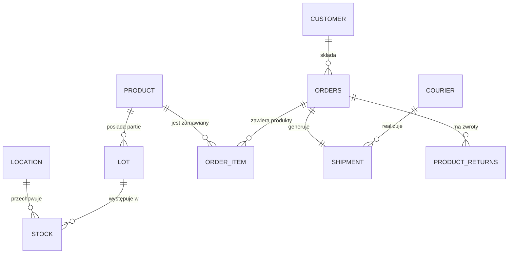

# Dokumentacja: DATAFLOW WMS
## System Zarządzania Magazynem Oparty na Danych

---

## 1. Cel i Zastosowanie Biznesowe

### 1.1 Cel Projektu
**DataFlow WMS** to system bazodanowy klasy WMS dla e‑commerce, zaprojektowany jako wiarygodne źródło danych operacyjnych. System porządkuje przepływ informacji, stanowiący podstawę decyzji logistycznych, ekonomicznych i jakościowych.

### 1.2 Problemy Biznesowe
- Asymetria informacji między magazynem, logistyką a obsługą klienta
- Brak identyfikowalności partii (traceability) produktów
- Trudność w obiektywnej ocenie jakości usług kurierskich (SLA)
- Rozproszenie danych utrudniające analizę i raportowanie

### 1.3 Zastosowanie
System wspiera:
- Kontrolę procesów magazynowych
- Transparentność operacyjną
- Analitykę biznesową w logistyce e‑commerce

---

## 2. Projekt Bazy Danych i Diagram ER

### 2.1 Diagram ER

### 2.2 Encje i Atrybuty

#### **customer** (Klienci)
- `customer_id` (PK, SERIAL) - Unikalny identyfikator klienta
- `full_name` - Pełna nazwa klienta
- `email` (UNIQUE) - Adres email

#### **product** (Katalog Produktów)
- `product_id` (PK, SERIAL) - Unikalny identyfikator produktu
- `sku` (UNIQUE) - Kod SKU produktu
- `name` - Nazwa produktu

#### **lot** (Zarządzanie Partiami)
- `lot_id` (PK, SERIAL) - Unikalny identyfikator partii
- `product_id` (FK) - Referencja do produktu
- `batch_number` - Numer partii produkcyjnej
- `expiration_date` - Data ważności partii

#### **location** (Struktura Magazynu)
- `location_id` (PK, SERIAL) - Unikalny identyfikator lokalizacji
- `zone` - Strefa magazynowa (A, B, C, D...)
- `location_type` - Typ: PICKING (kompletacja) lub STORAGE (przechowywanie)

#### **stock** (Stany Magazynowe)
- `product_id` (FK, część PK) - Referencja do produktu
- `location_id` (FK, część PK) - Referencja do lokalizacji
- `lot_id` (FK, część PK) - Referencja do partii
- `quantity` - Ilość produktu

#### **courier** (Kurierzy)
- `courier_id` (PK, SERIAL) - Unikalny identyfikator kuriera
- `name` - Nazwa firmy kurierskiej
- `max_days` - Maksymalna liczba dni dostawy (SLA)

#### **orders** (Nagłówki Zamówień)
- `order_id` (PK, SERIAL) - Unikalny identyfikator zamówienia
- `customer_id` (FK) - Referencja do klienta
- `order_date` - Data i czas złożenia zamówienia
- `status` - Status: PENDING, SHIPPED, DELIVERED

#### **order_item** (Pozycje Zamówienia)
- `order_item_id` (PK, SERIAL) - Unikalny identyfikator pozycji
- `order_id` (FK) - Referencja do zamówienia
- `product_id` (FK) - Referencja do produktu
- `quantity` - Ilość zamówionego produktu
- `price_per_unit` - Cena jednostkowa

#### **shipment** (Wysyłki)
- `shipment_id` (PK, SERIAL) - Unikalny identyfikator wysyłki
- `order_id` (FK, UNIQUE) - Referencja do zamówienia (1:1)
- `courier_id` (FK) - Referencja do kuriera
- `delivery_date` - Data i czas dostawy

#### **product_returns** (Zwroty)
- `return_id` (PK, SERIAL) - Unikalny identyfikator zwrotu
- `order_id` (FK) - Referencja do zamówienia
- `reason` - Powód zwrotu
- `return_date` - Data zwrotu

### 2.3 Relacje Między Encjami

Relacje są widoczne na diagramie ER powyżej. Kluczowe zależności:
- **1:N**: customer→orders, orders→order_item, product→lot, product→stock, courier→shipment, orders→product_returns
- **1:1**: orders→shipment (UNIQUE constraint)

### 2.4 Normalizacja i Klucze

#### Poziomy Normalizacji
Projekt jest w trzeciej postaci normalnej (3NF), ponieważ wszystkie tabele spełniają wymagania: wartości atomowe, zależność od pełnego klucza głównego oraz brak zależności przechodnich.

#### Klucze i Indeksy
- **Klucze główne**: Wszystkie tabele używają SERIAL (auto-increment), `stock` ma klucz złożony `(product_id, location_id, lot_id)`
- **Klucze obce**: Wszystkie relacje zdefiniowane z CASCADE dla usuwania
- **Indeksy**: Automatyczne dla PK/UNIQUE (email, sku)

---

## 3. Zbudowanie Bazy Danych i Wprowadzenie Danych

### 3.1 Instrukcje Uruchomienia

Szczegóły w pliku `README.md`. Krótko:
1. Utwórz bazę: `CREATE DATABASE dataflow_wms;`
2. Uruchom: `\i schema.sql` i `\i data.sql`

### 3.2 Struktura Skryptów
- `schema.sql` - Definicje tabel, typów ENUM, kluczy, relacji (DDL)
- `data.sql` - Dane testowe (DML)

---

## 4. Scenariusz Analitycznego Wykorzystania

### 4.1 Instrukcje SQL dla Analitycznych Zapytań Biznesowych

Zapytania analityczne znajdują się w pliku `analyst_queries.sql`. Każde zapytanie zawiera:
- **Cel biznesowy** - problem, który rozwiązuje
- **Pytanie analityczne / KPI** - mierzalny wskaźnik
- **Interpretacja wyniku** - wnioski biznesowe

Przykładowe scenariusze:
- Analiza sprawności kurierów (SLA) - czy deklarowane czasy dostaw są dotrzymywane
- Analiza stanów magazynowych - gdzie znajdują się produkty i w jakich ilościach
- Analiza rotacji produktów - które produkty są najczęściej zamawiane

---

## 5. Scenariusz Administracyjny

Scenariusz znajduje się w pliku `admin_queries.sql`.

### 5.1 Nowa Tabela: System Zwrotów

Utworzono tabelę `product_returns` do obsługi zwrotów produktów. Szczegóły w pliku `admin_queries.sql`.

### 5.2 Nowy Użytkownik

Utworzono rolę `analityk_magazynu` z uprawnieniami tylko do odczytu (SELECT). Szczegóły w pliku `admin_queries.sql`.

### 5.3 Operacje CRUD na Zestawach Danych

Scenariusz administracyjny zawiera przykłady operacji:
- **UTWÓRZ (CREATE)**: Rejestracja nowego zwrotu produktu
- **ZAKTUALIZUJ (UPDATE)**: Przesunięcie międzystrefowe zapasów (ze STORAGE do PICKING)
- **USUŃ (DELETE)**: Usunięcie wadliwej lub przeterminowanej partii z systemu

Wszystkie zapytania znajdują się w pliku `admin_queries.sql`.

---

**Autorzy**: Nikodem Boniecki, Adam Remfeld, Kacper Nowaczyk
