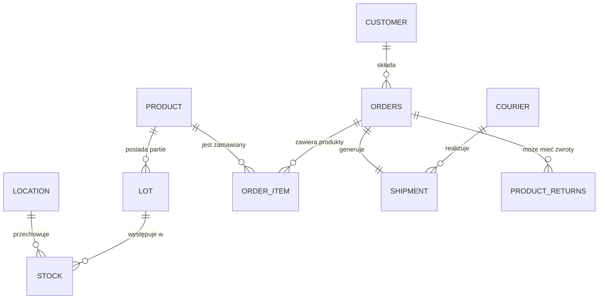

# Diagram ER - DATAFLOW WMS

## Diagram ER w Formacie Mermaid

## Relacje Szczegółowe

### Relacje 1:N
1. **CUSTOMER** ──< **ORDERS** : Jeden klient może mieć wiele zamówień
2. **ORDERS** ──< **ORDER_ITEM** : Jedno zamówienie może zawierać wiele pozycji
3. **PRODUCT** ──< **ORDER_ITEM** : Jeden produkt może być w wielu pozycjach
4. **PRODUCT** ──< **LOT** : Jeden produkt może mieć wiele partii
5. **PRODUCT** ──< **STOCK** : Jeden produkt może być w wielu lokalizacjach
6. **LOCATION** ──< **STOCK** : Jedna lokalizacja może przechowywać wiele produktów
7. **LOT** ──< **STOCK** : Jedna partia może być w wielu lokalizacjach
8. **COURIER** ──< **SHIPMENT** : Jeden kurier może obsłużyć wiele wysyłek
9. **ORDERS** ──< **PRODUCT_RETURNS** : Jedno zamówienie może mieć wiele zwrotów

### Relacje 1:1
1. **ORDERS** ── **SHIPMENT** : Jedno zamówienie ma dokładnie jedną wysyłkę (UNIQUE constraint)

## Kluczowe Elementy Diagramu

### Tabela Faktów: STOCK
- **Klucz złożony**: (product_id, location_id, lot_id)
- **Znaczenie**: Odzwierciedla wielowymiarowość danych magazynowych
- **Relacje**: Łączy produkt, lokalizację i partię

### Punkt Pomiaru: SHIPMENT
- **Relacja 1:1** z ORDERS (UNIQUE)
- **Znaczenie**: Punkt pomiaru jakości operacyjnej
- **SLA**: Powiązanie z COURIER dla analizy czasów dostaw

### Traceability: LOT
- **Znaczenie**: Identyfikowalność partii produktów
- **Relacje**: Łączy produkt z zapasem magazynowym
- **Zastosowanie**: Analiza rotacji i ryzyka przeterminowania

---